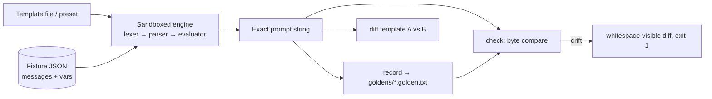

# chatstencil

[English](README.md) | [中文](README.zh.md) | [日本語](README.ja.md)

[](LICENSE) [](CHANGELOG.md) [](pyproject.toml)  [](CONTRIBUTING.md)

**チャットテンプレートのオープンソース・ゴールデンテストツール——モデルが実際に見る正確なプロンプト文字列をレンダリングし、1 バイトのドリフトで即座に失敗させる。**


```bash
git clone https://github.com/JaydenCJ/chatstencil && cd chatstencil && pip install -e .
```

> **プレリリース：** chatstencil はまだ PyPI に公開されていません。初回リリースまでは [JaydenCJ/chatstencil](https://github.com/JaydenCJ/chatstencil) をクローンし、リポジトリのルートで `pip install -e .` を実行してください。

## なぜ chatstencil？

誤ったチャットテンプレートはクラッシュしません——ローカルモデルの回答品質を静かに毀損し続けるだけで、それを捉える唯一のデバッグ手順こそ、誰もが飛ばすあの一歩です：テンプレートが生成した正確な最終文字列を見ること。今日それをやろうとすると、レンダリング関数 1 つのために巨大な ML ライブラリと tokenizer のダウンロードを持ち込むことになり、しかもその文字列を*テスト*するものは何もない——一度眺めて終わりです。chatstencil はその欠けた一歩をツールにしました：チャットテンプレートが実際に使う Jinja サブセットを標準ライブラリだけで実装したサンドボックス化エンジン、JSON メッセージフィクスチャ、そしてレンダリング結果のバイト列を保存しテンプレート編集で変化したら大声で失敗する（diff 内の `\n` や `\t` はすべて可視化）ゴールデンワークフローです。モデルも tokenizer も同梱しません：あなたがテンプレートを持ち込み、chatstencil が文字列を固定します。

|  | chatstencil | transformers `apply_chat_template` | promptfoo | テンプレートの目視 |
|---|---|---|---|---|
| 正確な最終プロンプト文字列を表示 | はい | はい（テンソルパイプラインの奥深く） | いいえ（モデル出力をテスト） | いいえ |
| 文字列をバイト単位でゴールデンテスト | はい | いいえ | いいえ | いいえ |
| diff で不可視文字を可視化 | はい（`\n`、`\t`、末尾改行） | いいえ | いいえ | いいえ |
| モデル/tokenizer のダウンロードが必要 | いいえ | はい | プロバイダ依存 | いいえ |
| 同一会話で 2 つのテンプレートを diff | はい | いいえ | いいえ | かろうじて |
| ランタイム依存 | 0 | 10 | Node + 巨大な依存ツリー | 0 |

<sub>依存数は 2026-07 時点で各パッケージが宣言するランタイム要件：transformers 4.x は PyPI 上で 10 個；promptfoo は巨大な推移的依存ツリーを持つ Node CLI。chatstencil の数値は [pyproject.toml](pyproject.toml) の `dependencies = []` そのものです。</sub>

## 特長

- **誰もが飛ばすデバッグ手順をコマンド 1 つに** —— `chatstencil render` は正確な文字列を出力し、`--escape` はすべての `\n`、`\t`、バックスラッシュを可視化。「`[/INST]` の前のスペースが消えている」がもう見えない問題ではなくなります。
- **プロンプト文字列のゴールデンテスト** —— `record` が（フィクスチャ, テンプレート）ごとにレンダリング結果のバイト列を凍結；`check` は再レンダリングして最初の不一致バイトで終了コード 1 を返し、欠落・陳腐化したゴールデンも指摘。テンプレート編集がモデルに届く前にゲートできます。
- **本物のエンジン、依存ゼロ** —— チャットテンプレートが実際に使う Jinja サブセット（空白制御、`loop.*`、`namespace()`、`raise_exception`、22 個のフィルタ）を Python 標準ライブラリだけで実装。スコープ化された `set` や探査可能な undefined 値など、Jinja に忠実なセマンティクスを備えます。
- **許可リストによるサンドボックス** —— テンプレートはサードパーティのファイル。属性アクセスはマッピングのキーと型ごとの明示的メソッドリストのみを解決し、`.format()` 系のエスケープは名前ごと拒否されます。
- **バイト単位で正確な 5 つのプリセット** —— `chatml`、`inst`、`zephyr`、`alpaca`、`plain`。それぞれ既定の特殊トークン付き。`chatstencil diff` で自作テンプレートを既知の正しいワイヤ形式と比較できます。
- **分岐系バグを捕まえるフィクスチャ** —— フィクスチャごとの変数と `add_generation_prompt` を持つ JSON 会話を厳格に検証；同梱の例はテンプレートが最も間違えやすい「system メッセージなし」の分岐をカバーします。

## クイックスタート

インストール：

```bash
git clone https://github.com/JaydenCJ/chatstencil && cd chatstencil && pip install -e .
```

`chatml` プリセットでフィクスチャをレンダリングし、正確な文字列を確認：

```bash
chatstencil render -t chatml -f examples/fixtures/smalltalk.json
```

```text
<|im_start|>system
You are a concise assistant. Answer in one sentence.<|im_end|>
<|im_start|>user
What does a chat template do?<|im_end|>
<|im_start|>assistant
```

テンプレートファイルも同じ手順でゴールデンテストできます：記録、編集、チェック。ここでは善意の `-` が例のテンプレートの `` を `` に変えてしまいました——出力は実際の実行から転記：

```bash
chatstencil record -t examples/templates/support-bot.jinja -f examples/fixtures/smalltalk.json -g goldens/
chatstencil check  -t examples/templates/support-bot.jinja -f examples/fixtures/smalltalk.json -g goldens/
```

```text
MISMATCH  smalltalk
--- golden:smalltalk--support-bot.golden.txt
+++ rendered:now
@@ -1,5 +1,3 @@
 <|im_start|>system\n
-You are a concise assistant. Answer in one sentence.<|im_end|>\n
-<|im_start|>user\n
-What does a chat template do?<|im_end|>\n
-<|im_start|>assistant\n
+You are a concise assistant. Answer in one sentence.<|im_end|><|im_start|>user\n
+What does a chat template do?<|im_end|><|im_start|>assistant\n
1 checked, 1 failing
```

すべてのターン区切りが音もなく消えました——終了コード 1、モデルが目にする前に捕捉。同じ API は Python からも使えます：

```python
from chatstencil import render_chat

print(render_chat(open("examples/templates/support-bot.jinja").read(),
                  [{"role": "user", "content": "hi"}]))
```

## CLI リファレンス

| コマンド | 終了コード | 効果 |
|---|---|---|
| `render -t TPL -f FIXTURE [--escape] [--var K=V]` | 0 / 2 | 正確なレンダリング文字列を出力（改行を追加しない） |
| `record -t TPL -f FIXTURES... -g DIR` | 0 / 2 | フィクスチャごとにゴールデンを書き込み/更新 |
| `check -t TPL -f FIXTURES... -g DIR` | 0 / 1 / 2 | ゴールデンとバイト比較；不一致・欠落・陳腐化を報告 |
| `diff TPL_A TPL_B -f FIXTURE` | 0 / 1 / 2 | 同一会話を 2 つのテンプレートでレンダリングして diff |
| `presets` | 0 | 組み込みテンプレートと既定トークンを一覧表示 |

`-t` はプリセット名またはテンプレートファイルのパスを受け付けます。`--generation-prompt` / `--no-generation-prompt` はフィクスチャ設定を上書き；`--var key=value`（可能なら JSON として解析）は任意の変数を上書きします。例：`--var eos_token='"<END>"'`。

## フィクスチャ

| キー | 既定値 | 効果 |
|---|---|---|
| `messages` | 必須 | `{role, content}` オブジェクトの配列（0.1.0 は文字列 content のみ） |
| `name` | ファイル名の幹 | ゴールデンのファイル名を決める：`<name>--<template>.golden.txt` |
| `vars` | `{}` | 追加のテンプレート変数（例：`bos_token`）；予約名は拒否 |
| `add_generation_prompt` | `true` | テンプレートが assistant ターンの開始マーカーを付けるか |
| `description` | `""` | 人間向けメモ、レンダラは無視 |

サポートするテンプレート方言（文、フィルタ、テスト、メソッド許可リスト、完全な Jinja との意図的な差異）は [`docs/template-subset.md`](docs/template-subset.md) に記載；実行可能なフィクスチャ、カスタムテンプレート、コミット済みゴールデンは [`examples/`](examples/) にあります。

## 検証

このリポジトリは CI を同梱しません；上記の主張はすべてローカル実行で検証されています。このリポジトリのチェックアウトから再現できます：

```bash
pip install -e '.[dev]' && pytest && bash scripts/smoke.sh
```

出力（実際の実行から転記、`...` で省略）：

```text
90 passed in 0.47s
...
[drift] MISMATCH  smalltalk
SMOKE OK
```

## アーキテクチャ



## ロードマップ

- [x] サンドボックス化テンプレートエンジン、5 プリセット、JSON フィクスチャ、golden record/check/diff CLI（v0.1.0）
- [ ] PyPI 公開、`pip install chatstencil` 対応
- [ ] `tokenizer_config.json` と GGUF メタデータからのテンプレート直接インポート
- [ ] ツール呼び出しメッセージのフィクスチャ（構造化 `content`、`tool` ロール規約）
- [ ] トークン境界の注記：指定 tokenizer がレンダリング文字列をどこで分割するかを表示
- [ ] `chatstencil lint`：定番のテンプレートミス（余計な trim、無条件 BOS）への静的警告

全リストは [open issues](https://github.com/JaydenCJ/chatstencil/issues) を参照してください。

## コントリビュート

コントリビュート歓迎です——まずは [good first issue](https://github.com/JaydenCJ/chatstencil/issues?q=is%3Aissue+is%3Aopen+label%3A%22good+first+issue%22) から、または [discussion](https://github.com/JaydenCJ/chatstencil/discussions) を立ててください。開発環境の構築は [CONTRIBUTING.md](CONTRIBUTING.md) を参照。

## ライセンス

[MIT](LICENSE)
