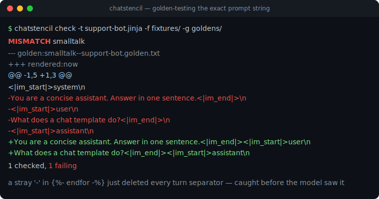
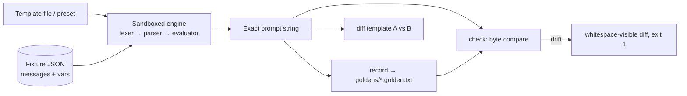

# chatstencil

[English](README.md) | [中文](README.zh.md) | [日本語](README.ja.md)

[](LICENSE) [](CHANGELOG.md) [](pyproject.toml)  [](CONTRIBUTING.md)

**Open-source golden testing for chat templates — render the exact prompt string your model will see, and fail on the first drifted byte.**



```bash
git clone https://github.com/JaydenCJ/chatstencil && cd chatstencil && pip install -e .
```

> **Pre-release:** chatstencil is not yet published to PyPI. Until the first release, clone [JaydenCJ/chatstencil](https://github.com/JaydenCJ/chatstencil) and run `pip install -e .` from the repository root.

## Why chatstencil?

A wrong chat template does not crash — it quietly degrades every answer a local model gives, and the one debugging step that catches it is the one everyone skips: looking at the exact final string the template produced. Doing that today means dragging in a full ML library and a tokenizer download just to call one render function, and even then nothing *tests* the string — you eyeball it once and move on. chatstencil is that missing step as a tool: a sandboxed, stdlib-only engine for the Jinja subset chat templates actually use, JSON message fixtures, and a golden workflow that stores the rendered bytes and fails loudly (with `\n` and `\t` made visible in the diff) when a template edit changes them. It ships no model and no tokenizer: you bring the template, chatstencil pins the string.

|  | chatstencil | transformers `apply_chat_template` | promptfoo | eyeballing the template |
|---|---|---|---|---|
| Shows the exact final prompt string | Yes | Yes (buried in a tensor pipeline) | No (tests model outputs) | No |
| Golden-tests the string byte-for-byte | Yes | No | No | No |
| Invisible characters visible in diffs | Yes (`\n`, `\t`, trailing final-newline) | No | No | No |
| Needs a model or tokenizer download | No | Yes | Provider-dependent | No |
| Diffs two templates on one conversation | Yes | No | No | Sort of |
| Runtime dependencies | 0 | 10 | Node + large tree | 0 |

<sub>Dependency counts are declared runtime requirements as of 2026-07: transformers 4.x lists 10 on PyPI; promptfoo is a Node CLI with a large transitive tree. chatstencil's count is `dependencies = []` in [pyproject.toml](pyproject.toml).</sub>

## Features

- **The debugging step everyone skips, as one command** — `chatstencil render` prints the exact string, and `--escape` makes every `\n`, `\t`, and backslash visible, so "the space before `[/INST]` is missing" stops being invisible.
- **Golden tests for prompt strings** — `record` freezes the rendered bytes per (fixture, template) pair; `check` re-renders and exits 1 on the first mismatched byte, and also flags missing and stale goldens. Gate template edits with it before they ever reach a model.
- **A real engine, zero dependencies** — the Jinja subset chat templates actually use (whitespace control, `loop.*`, `namespace()`, `raise_exception`, 22 filters), implemented on the Python standard library with Jinja-faithful semantics like scoped `set` and probe-able undefined values.
- **Sandboxed by allowlist** — templates are third-party files; attribute access resolves only mapping keys and an explicit per-type method list, so `.format()`-style escapes are rejected by name.
- **Five byte-exact presets** — `chatml`, `inst`, `zephyr`, `alpaca`, `plain`, each with its own default special tokens; diff your template against a known-good wire format with `chatstencil diff`.
- **Fixtures that catch the branchy bugs** — JSON conversations with per-fixture vars and `add_generation_prompt`, strictly validated; the shipped examples cover the no-system-message branch templates most often get wrong.

## Quickstart

Install:

```bash
git clone https://github.com/JaydenCJ/chatstencil && cd chatstencil && pip install -e .
```

Render a fixture through the `chatml` preset and see the exact string:

```bash
chatstencil render -t chatml -f examples/fixtures/smalltalk.json
```

```text
<|im_start|>system
You are a concise assistant. Answer in one sentence.<|im_end|>
<|im_start|>user
What does a chat template do?<|im_end|>
<|im_start|>assistant
```

Golden-test a template file the same way: record, edit, check. Here a well-meaning `-` turned the example template's `` into `` — output copied from a real run:

```bash
chatstencil record -t examples/templates/support-bot.jinja -f examples/fixtures/smalltalk.json -g goldens/
chatstencil check  -t examples/templates/support-bot.jinja -f examples/fixtures/smalltalk.json -g goldens/
```

```text
MISMATCH  smalltalk
--- golden:smalltalk--support-bot.golden.txt
+++ rendered:now
@@ -1,5 +1,3 @@
 <|im_start|>system\n
-You are a concise assistant. Answer in one sentence.<|im_end|>\n
-<|im_start|>user\n
-What does a chat template do?<|im_end|>\n
-<|im_start|>assistant\n
+You are a concise assistant. Answer in one sentence.<|im_end|><|im_start|>user\n
+What does a chat template do?<|im_end|><|im_start|>assistant\n
1 checked, 1 failing
```

Every turn separator silently vanished — exit code 1, caught before a model ever saw it. The same API is available from Python:

```python
from chatstencil import render_chat

print(render_chat(open("examples/templates/support-bot.jinja").read(),
                  [{"role": "user", "content": "hi"}]))
```

## CLI reference

| Command | Exit codes | Effect |
|---|---|---|
| `render -t TPL -f FIXTURE [--escape] [--var K=V]` | 0 / 2 | Print the exact rendered string (no trailing newline added) |
| `record -t TPL -f FIXTURES... -g DIR` | 0 / 2 | Write/refresh one golden per fixture |
| `check -t TPL -f FIXTURES... -g DIR` | 0 / 1 / 2 | Byte-compare against goldens; reports mismatched, missing, stale |
| `diff TPL_A TPL_B -f FIXTURE` | 0 / 1 / 2 | Render one conversation through two templates and diff |
| `presets` | 0 | List built-in templates and their default tokens |

`-t` accepts a preset name or a template file path. `--generation-prompt` / `--no-generation-prompt` override the fixture; `--var key=value` (JSON-parsed when possible) overrides any variable, e.g. `--var eos_token='"<END>"'`.

## Fixtures

| Key | Default | Effect |
|---|---|---|
| `messages` | required | Array of `{role, content}` objects (string content only in 0.1.0) |
| `name` | file stem | Keys the golden filename: `<name>--<template>.golden.txt` |
| `vars` | `{}` | Extra template variables, e.g. `bos_token`; reserved names rejected |
| `add_generation_prompt` | `true` | Whether the template appends the assistant-turn opener |
| `description` | `""` | Human note, ignored by the renderer |

The supported template dialect (statements, filters, tests, the method allowlist, and the deliberate differences from full Jinja) is documented in [`docs/template-subset.md`](docs/template-subset.md); runnable fixtures, a custom template, and committed goldens live in [`examples/`](examples/).

## Verification

This repository ships no CI; every claim above is verified by local runs. Reproduce them from a checkout of this repository:

```bash
pip install -e '.[dev]' && pytest && bash scripts/smoke.sh
```

Output (copied from a real run, truncated with `...`):

```text
90 passed in 0.47s
...
[drift] MISMATCH  smalltalk
SMOKE OK
```

## Architecture



## Roadmap

- [x] Sandboxed template engine, five presets, JSON fixtures, golden record/check/diff CLI (v0.1.0)
- [ ] PyPI release with `pip install chatstencil`
- [ ] Import templates directly from `tokenizer_config.json` and GGUF metadata
- [ ] Tool-call message fixtures (structured `content`, `tool` role conventions)
- [ ] Token-boundary annotation: show where a given tokenizer splits the rendered string
- [ ] `chatstencil lint`: static warnings for the classic template mistakes (stray trims, unconditional BOS)

See the [open issues](https://github.com/JaydenCJ/chatstencil/issues) for the full list.

## Contributing

Contributions are welcome — start with a [good first issue](https://github.com/JaydenCJ/chatstencil/issues?q=is%3Aissue+is%3Aopen+label%3A%22good+first+issue%22) or open a [discussion](https://github.com/JaydenCJ/chatstencil/discussions). See [CONTRIBUTING.md](CONTRIBUTING.md) for the development setup.

## License

[MIT](LICENSE)
