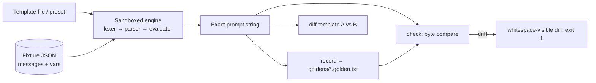

# chatstencil

[English](README.md) | [中文](README.zh.md) | [日本語](README.ja.md)

[](LICENSE) [](CHANGELOG.md) [](pyproject.toml)  [](CONTRIBUTING.md)

**开源的 chat template 黄金测试工具——渲染出模型将看到的精确 prompt 字符串，第一个漂移字节即报错。**


```bash
git clone https://github.com/JaydenCJ/chatstencil && cd chatstencil && pip install -e .
```

> **预发布：** chatstencil 尚未发布到 PyPI。在首个正式版本之前，请克隆 [JaydenCJ/chatstencil](https://github.com/JaydenCJ/chatstencil) 并在仓库根目录运行 `pip install -e .`。

## 为什么选择 chatstencil？

错误的 chat template 不会崩溃——它只是悄悄拉低本地模型每一次回答的质量，而唯一能抓住它的调试步骤恰恰是大家都跳过的那一步：查看模板产出的精确最终字符串。如今做这件事意味着为了调用一个渲染函数而拖进整个 ML 库外加下载 tokenizer，而且即便如此也没有任何东西在*测试*这个字符串——你瞄一眼就翻篇了。chatstencil 把这个缺失的步骤做成了工具：一个只用标准库、沙箱化、实现 chat template 实际使用的 Jinja 子集的引擎，JSON 消息 fixture，以及一套黄金工作流——存下渲染出的字节，当模板改动让它们变化时大声报错（diff 中的 `\n` 和 `\t` 全部可见）。它不携带模型也不携带 tokenizer：你带来模板，chatstencil 钉住字符串。

|  | chatstencil | transformers `apply_chat_template` | promptfoo | 肉眼盯模板 |
|---|---|---|---|---|
| 展示精确的最终 prompt 字符串 | 是 | 是（埋在张量流水线里） | 否（测试的是模型输出） | 否 |
| 逐字节黄金测试该字符串 | 是 | 否 | 否 | 否 |
| diff 中不可见字符全部可见 | 是（`\n`、`\t`、末尾换行） | 否 | 否 | 否 |
| 需要下载模型或 tokenizer | 否 | 是 | 取决于 provider | 否 |
| 用同一对话 diff 两个模板 | 是 | 否 | 否 | 勉强算 |
| 运行时依赖 | 0 | 10 | Node + 庞大依赖树 | 0 |

<sub>依赖数为 2026-07 时各包声明的运行时依赖：transformers 4.x 在 PyPI 上列出 10 个；promptfoo 是带庞大传递依赖树的 Node CLI。chatstencil 的数字即 [pyproject.toml](pyproject.toml) 中的 `dependencies = []`。</sub>

## 特性

- **把大家都跳过的调试步骤浓缩成一条命令** —— `chatstencil render` 打印精确字符串，`--escape` 让每个 `\n`、`\t` 和反斜杠可见，"`[/INST]` 前少了个空格"从此不再隐形。
- **给 prompt 字符串做黄金测试** —— `record` 按（fixture, 模板）冻结渲染字节；`check` 重新渲染，第一个不匹配字节即以退出码 1 失败，还会标出缺失和过期的 golden。在模板改动触达模型之前就用它把关。
- **真正的引擎，零依赖** —— chat template 实际使用的 Jinja 子集（空白控制、`loop.*`、`namespace()`、`raise_exception`、22 个过滤器），仅用 Python 标准库实现，语义忠实于 Jinja，包括作用域化的 `set` 和可探测的 undefined 值。
- **按白名单沙箱化** —— 模板是第三方文件；属性访问只解析映射键和每种类型的显式方法白名单，`.format()` 之类的逃逸会被按名字拒绝。
- **五个字节级精确的预设** —— `chatml`、`inst`、`zephyr`、`alpaca`、`plain`，各自带默认特殊 token；用 `chatstencil diff` 把你的模板与已知正确的线格式对比。
- **能抓住分支型 bug 的 fixture** —— 带 per-fixture 变量与 `add_generation_prompt` 的 JSON 对话，严格校验；随附示例覆盖了模板最容易写错的无 system 消息分支。

## 快速上手

安装：

```bash
git clone https://github.com/JaydenCJ/chatstencil && cd chatstencil && pip install -e .
```

用 `chatml` 预设渲染一个 fixture，查看精确字符串：

```bash
chatstencil render -t chatml -f examples/fixtures/smalltalk.json
```

```text
<|im_start|>system
You are a concise assistant. Answer in one sentence.<|im_end|>
<|im_start|>user
What does a chat template do?<|im_end|>
<|im_start|>assistant
```

模板文件也用同样的方式做黄金测试：录制、改动、检查。这里有人好心地把示例模板的 `` 改成了 ``——输出摘自真实运行：

```bash
chatstencil record -t examples/templates/support-bot.jinja -f examples/fixtures/smalltalk.json -g goldens/
chatstencil check  -t examples/templates/support-bot.jinja -f examples/fixtures/smalltalk.json -g goldens/
```

```text
MISMATCH  smalltalk
--- golden:smalltalk--support-bot.golden.txt
+++ rendered:now
@@ -1,5 +1,3 @@
 <|im_start|>system\n
-You are a concise assistant. Answer in one sentence.<|im_end|>\n
-<|im_start|>user\n
-What does a chat template do?<|im_end|>\n
-<|im_start|>assistant\n
+You are a concise assistant. Answer in one sentence.<|im_end|><|im_start|>user\n
+What does a chat template do?<|im_end|><|im_start|>assistant\n
1 checked, 1 failing
```

所有轮次分隔符悄无声息地消失了——退出码 1，在任何模型看到它之前就被抓住。同样的 API 也可以在 Python 中使用：

```python
from chatstencil import render_chat

print(render_chat(open("examples/templates/support-bot.jinja").read(),
                  [{"role": "user", "content": "hi"}]))
```

## CLI 参考

| 命令 | 退出码 | 作用 |
|---|---|---|
| `render -t TPL -f FIXTURE [--escape] [--var K=V]` | 0 / 2 | 打印精确的渲染字符串（不额外追加换行） |
| `record -t TPL -f FIXTURES... -g DIR` | 0 / 2 | 为每个 fixture 写入/刷新一个 golden |
| `check -t TPL -f FIXTURES... -g DIR` | 0 / 1 / 2 | 与 golden 逐字节对比；报告不匹配、缺失、过期 |
| `diff TPL_A TPL_B -f FIXTURE` | 0 / 1 / 2 | 用两个模板渲染同一对话并 diff |
| `presets` | 0 | 列出内置模板及其默认 token |

`-t` 接受预设名或模板文件路径。`--generation-prompt` / `--no-generation-prompt` 覆盖 fixture 的设置；`--var key=value`（尽可能按 JSON 解析）覆盖任意变量，如 `--var eos_token='"<END>"'`。

## Fixture

| 键 | 默认值 | 作用 |
|---|---|---|
| `messages` | 必填 | `{role, content}` 对象数组（0.1.0 仅支持字符串 content） |
| `name` | 文件名主干 | 决定 golden 文件名：`<name>--<template>.golden.txt` |
| `vars` | `{}` | 额外模板变量（如 `bos_token`）；保留名会被拒绝 |
| `add_generation_prompt` | `true` | 模板是否追加 assistant 回合的开头标记 |
| `description` | `""` | 人类可读备注，渲染器忽略 |

支持的模板方言（语句、过滤器、测试、方法白名单以及与完整 Jinja 的刻意差异）见 [`docs/template-subset.md`](docs/template-subset.md)；可运行的 fixture、自定义模板和已提交的 golden 在 [`examples/`](examples/)。

## 验证

本仓库不携带 CI；上面的每一条声明都由本地运行验证。从本仓库的检出即可复现：

```bash
pip install -e '.[dev]' && pytest && bash scripts/smoke.sh
```

输出（摘自真实运行，用 `...` 截断）：

```text
90 passed in 0.47s
...
[drift] MISMATCH  smalltalk
SMOKE OK
```

## 架构



## 路线图

- [x] 沙箱化模板引擎、五个预设、JSON fixture、golden record/check/diff CLI（v0.1.0）
- [ ] 发布到 PyPI，支持 `pip install chatstencil`
- [ ] 直接从 `tokenizer_config.json` 和 GGUF 元数据导入模板
- [ ] 工具调用消息 fixture（结构化 `content`、`tool` 角色约定）
- [ ] token 边界标注：展示指定 tokenizer 在渲染字符串上的切分位置
- [ ] `chatstencil lint`：对经典模板错误（多余的 trim、无条件 BOS）做静态告警

完整列表见 [open issues](https://github.com/JaydenCJ/chatstencil/issues)。

## 贡献

欢迎贡献——从 [good first issue](https://github.com/JaydenCJ/chatstencil/issues?q=is%3Aissue+is%3Aopen+label%3A%22good+first+issue%22) 开始，或发起一个 [discussion](https://github.com/JaydenCJ/chatstencil/discussions)。开发环境搭建见 [CONTRIBUTING.md](CONTRIBUTING.md)。

## 许可证

[MIT](LICENSE)
